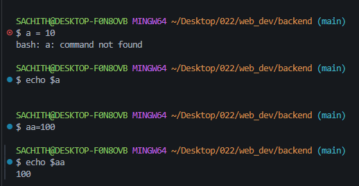

## shell commands :(defination + examples)
### 1. `echo`:
The `echo` command is used to display a line of text or a variable's value in the terminal. It is commonly used for printing messages, debugging, and displaying the output of commands.
#### Example:
```bash
echo "Hello, World!"
```This command will output:
```Hello, World!
```
---
- echo can also be used to display the value of a variable. 
- this is done by prefixing the variable name with a `$` symbol.
- this is not can't be done in cmd.exe but can be done in git bash and powershell.
For example:
```bash
name="Alice"
echo "My name is $name."
```This will output:
```My name is Alice.
```
---
- by using the `>` operator, you can redirect the output of the `echo` command to a file instead of displaying it in the terminal.
#### example:
```bash 
echo "Hello, World!" > output.txt
```This command will create a file named `output.txt` and write "Hello, World!" into it. You can then view the contents of the file using:
```bashcat output.txt
```This will display:
```Hello, World!
``` 
---
- by using the `>>` operator, you can append the output of the `echo` command to an existing file instead of overwriting it.
#### example:
```bash
echo "Welcome to Node.js!" >> output.txt
```This command will add "Welcome to Node.js!" to the end of `output.txt` without removing the existing content. If you view the contents of the file again:
```bash
cat output.txt
```This will display:
```Hello, World!
Welcome to Node.js!
```
---
- implementation of echo command in git bash: 


---